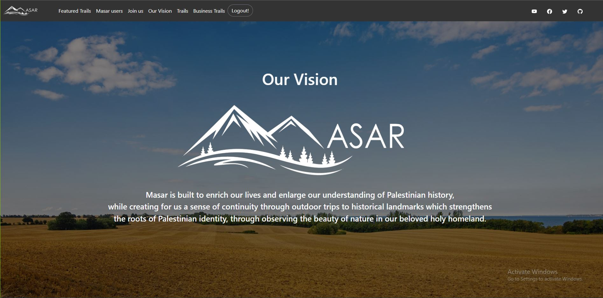
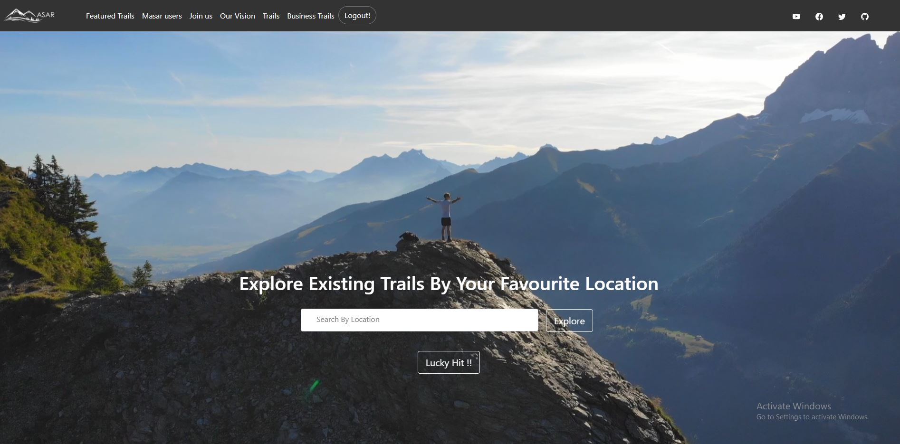
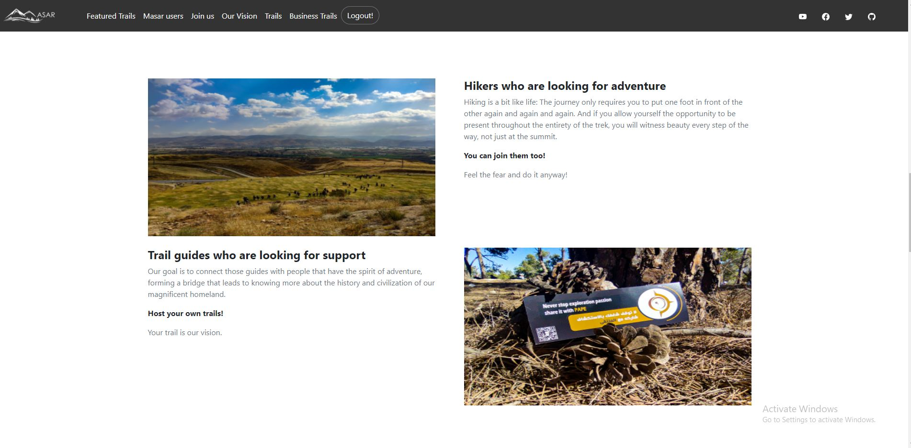
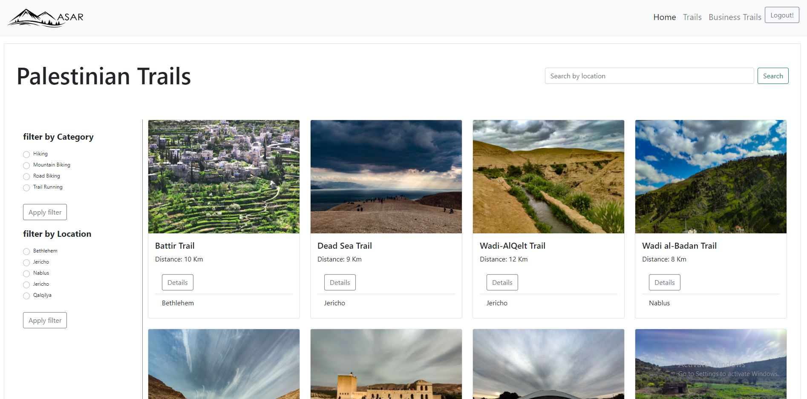
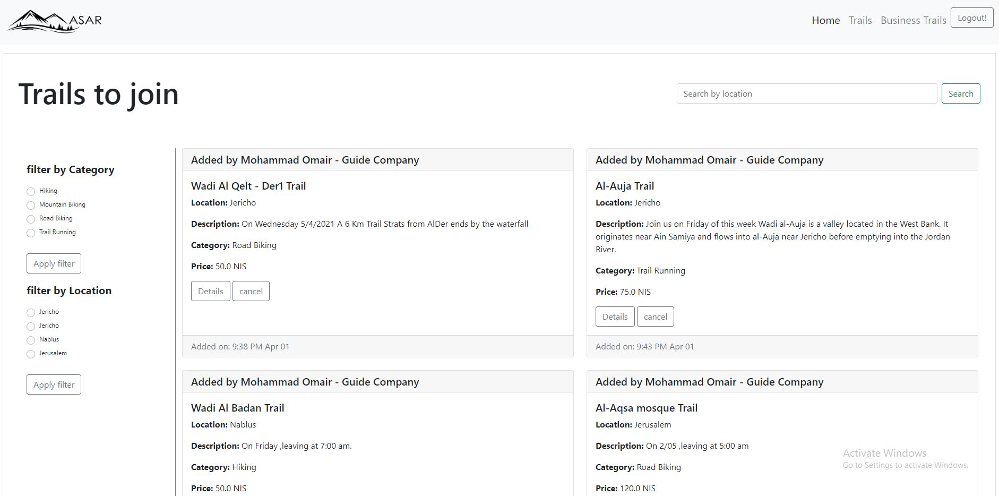
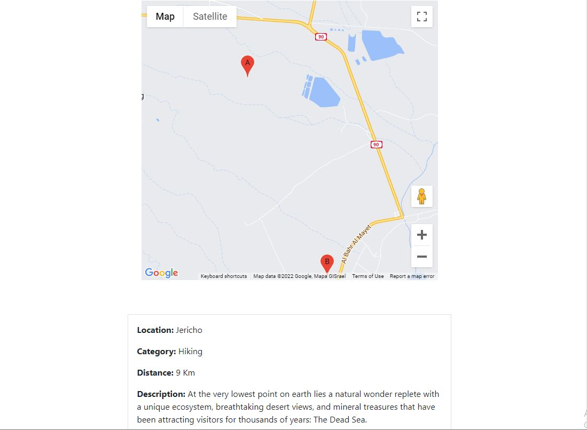

Hi There !! 
This is our very first Java project and we are very proud about it.

# Masar
## What is Masar ?
Masar is built to enrich our lives and enlarge our understanding of Palestinian history,
while creating for us a sense of continuity through outdoor trips to historical landmarks which strengthens
the roots of Palestinian identity, through observing the beauty of nature in our beloved holy homeland.

## Programing Languages, Frameworks and Libraries used:
HTML, CSS, Java, JavaScript, STS , Spring Security, BootStrap , Trello, GitHub, Jquery, Google Map API.

## Deployment Server:
Amazon Web Srvices

## Data Base:
SQLITE3

## Some Screenshots of the Website: 

## Functionality ?
The website will target two types of users, Hikers “Guests” who are looking for information about trails, and Clients “Hikes Organizers” who create hiking trips for hikers “Guests” to join. Spring  Security was used to specify the access and authorization rights for each user of the website.An external API was integrated into the website to determine the starting and ending points for each trail to provide the user with additional details about the trails.

## About us ? 
This Website was designed by three enthusiastic junior Web-Devlopers, The idea of the website was initiated from the need of stimulating tourism on both local and national domains, therefore encouraging people to know the story and history of palestine, our application is the voice of Palestine,reminding people from all over the world that once upon a time free souls has lived here, held their ground and defended their identities.

Designed and maintained By: __Mohammad Omair,  Mubarak Mubarak,  Masa Shabib__
